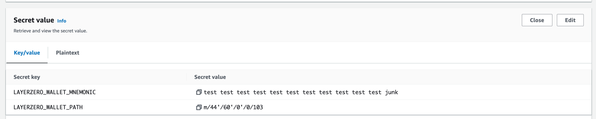

# gasolina-aws

## Description

This repository provides Infrastructure-As-Code (IAC) for installing Gasolina on AWS via CDK.

-   Bootstraps CDK
-   Creates a VPC
-   Uploads providers to S3
-   Setup a CloudWatch log group
-   Deploys the Gasolina API app on ECS
-   Sets up load balancer on Fargate in the VPC private subnet
-   Sets up API Gateway to route to the Gasolina API (we don't expose the load balancer directly, API Gateway offers TLS without the need for a certificate)

## Step-by-step instructions on setting up the infrastructure and deploying the Gasolina application

### 1. Setup aws valid credentials

-   Authenticate with AWS CLI with a valid method: https://docs.aws.amazon.com/cli/latest/userguide/cli-chap-authentication.html

### 2. Decide whether you want to use your own mnemonics or HSM-backed AWS KMS keys

-   If you want to use your own mnemonics you can configure a mnemonic per signer in the Gasolina API. Go to Secret Manager in AWS store and create a new secret for mnemonics and path.
    -   You want to store the secret as key-value pair. For a single secret:
    -   For the mnemonic use the key: LAYERZERO_WALLET_MNEMONIC
    -   For the PATH use the key: LAYERZERO_WALLET_PATH
-   If you want to use AWS KMS (backed by HSM), you can set this in your config and all key creation and registration into the application is done for you.

-   In the root directory of the project, run `yarn` to install all dependencies.



-   Bootstrap CDK if this is your first time using CDK in the AWS account. In `cdk/gasolina/` run:

```bash
cdk bootstrap
```

### 3. Configuration of infra and application

-   In `cdk/gasolina/config/index.ts` in the CONFIG object:
    -   Configure the AWS account number for the key of the object.
    -   `projectName`: Your unique project name (this is used for your s3 bucket which needs to be globally unique on AWS)
    -   `environment`: The environment your API will be pointing to on layerzero (mainnet/testnet)
    -   `availableChainNames`: The chains your Gasolina app supports in comma seperated format e.g. `ethereum,bsc,avalanche`
    -   `signerType`: Either `MNEMONIC` if you are using mnemonics stored in secret manager or `KMS` if you want CDK to set up asymmetric keys backed by HSM for you and register these keys into the Gasolina app.
        -   If `MNEMONIC`, the number of signers registered will be based on your wallet definitions in `walletConfig/<environment>.json`
        -   If `KMS`, you can optionally set `kmsNumOfSigners` in CONFIG. This value will create and register multiple keys into the same api
-   In `cdk/gasolina/config/providers/<environment>/providers.json`
    -   Configure all the RPC providers that you listed for the `availableChainNames` in the previous step.
-   In `cdk/gasolina/config/walletConfig/<environment>.json`
    -   Under `definitions`, add a Wallet Definition per Signer in Gasolina API that you registered in Secret Manager in the pre-requisites step.
        -   Configure the `address` of the signer
        -   Configure the `secretName` of that signer. This is used by the application to fetch the mnemonics when it needs to sign the payload

### [Optional] Setup Extra Context Verification

You can enhance message verification by adding your own custom rules.

To implement this, setup an API that would be called by gasolina whenever a message is received. The API will receive the complete context of the message, including additional onchain data, and will return a boolean value indicating whether the message can be signed.

API Input:

```typescript
{
    sentEvent: { // PacketSent event, emitted from the Endpoint contract
        lzMessageId: {
            pathwayId: {
                srcEid: number // Source chain eid (https://github.com/LayerZero-Labs/LayerZero-v2/blob/main/packages/layerzero-v2/evm/protocol/contracts/EndpointV2.sol#L23)
                dstEid: number
                sender: string // Sender oApp address on source chain
                receiver: string // Receiver oApp address on destination chain
                srcChainName: string // Source Chain Name
                dstChainName: string // Destination Chain Name
            }
            nonce: number
            ulnSendVersion: UlnVersion
        }
        guid: string // onchain guid
        message: string
        options: {
            // Adapter Params set on the source transaction
            lzReceive?: {
                gas: string
                value: string
            }
            nativeDrop?: {
                amount: string
                receiver: string
            }[]
            compose?: {
                index: number
                gas: string
                value: string
            }[]
            ordered?: boolean
        }
        payload?: string
        sendLibrary?: string
        onChainEvent: { // Transaction on the source chain
            chainName: string
            txHash: string
            blockHash: string
            blockNumber: number
        }
    }
    from: string // Address that initiated the transaction
}
```

API Output:

-   The API is expected to return a boolean value indicating whether the message can be signed.

Setup:

-   In `cdk/gasolina/config/index.ts` in the CONFIG object:
    -   Set `extraContextGasolinaUrl` to the URL of your API

### 4. CDK Deploy

Setup infrastructure and deploy the Gasolina application.
In `cdk/gasolina/` run:

```bash
cdk deploy
```

After the deployment is done, in the stdout you will see `Oracle.ApiGatewayUrl = <URL>`. Send this URL over to LayerZeroLabs.

### 5. Testing

Make an HTTP GET request to the ApiGatewayUrl at the following endpoint:

```
curl https://<ApiGatewayUrl>/signer-info?chainName=ethereum
```

If successful, you should see the signers registered on Gasolina API.

To test the API against a sample message, in the root directory run:

```bash
ts-node scripts/testDeployment -u <ApiGatewayUrl> -e <environment>
```

-   A successful response will look like:

```bash
--- [200] Successful request ---
Response: {
  signatures: [
    {
      signature: '<signature>',
      address: '<address>'
    },
    {
      signature: '<signature>',
      address: '<address>'
    }
  ]
}

```

## Getting signatures to change DVN onchain configs

### Setup
Depending on the environment (i.e testnet/mainnet), fill in the appropriate information regarding DVN addresses and KMS key ids in the `scripts/configChangePayloads/data` folder. The file names should be `dvn-addresses-<environment>.json` and `kms-keyids-<environment>.json` respectively. Take a look at existing testnet examples in the `scripts/configChangePayloads/data` folder to see how they need to be filled.
### Signatures for changing quorum
```
ts-node scripts/configChangePayloads/createSetQuorumSignatures.ts -e <environment> -c <comma-separated-chain-names> --oldQuorum <number> --newQuorum <number>
# e.g. ts-node scripts/configChangePayloads/createSetQuorumSignatures.ts -e testnet -c bsc,avalanche,fantom --oldQuorum 2 --newQuorum 1
```
### Signatures for adding/removing a signer
When adding a signer, you need to set `--shouldRevoke` arg as 0, when removing, you need to set it as 1.
```
ts-node scripts/configChangePayloads/createSetQuorumSignatures.ts -e <environment> -c <comma-separated-chain-names> --q <quorum> --signerAddress <string> --shouldRevoke <0 or 1>
# e.g. ts-node scripts/configChangePayloads/createAddOrRemoveSignerSignatures.ts -e testnet -c bsc,avalanche,fantom -q 1 --signerAddress 0x85e4857b7f15bbbbbc72d933a6357d3c22a0bbc7 --shouldRevoke 1
```

## Troubleshooting

### 1. CDK Deploy failed and cannot redeploy because resource already exists

-   Some resources have deletion projection policies. You will need to delete these resources before you can redeploy:
    -   the CloudWatch log group: `GasolinaMetricLogGroup`
    -   the S3 bucket: `providerconfigs-<projectName>-<environment>-gasolina`
